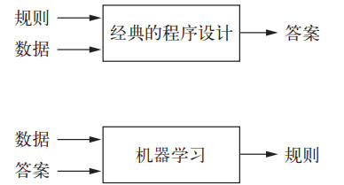
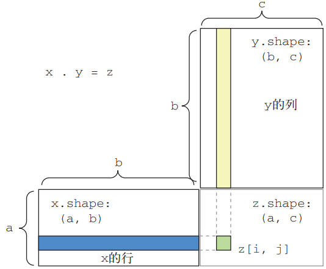
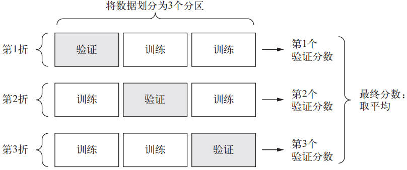
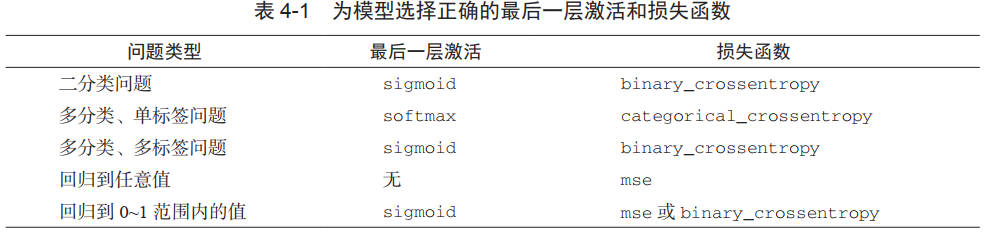

# Python深度学习[2018]

## 深度学习基础

## 0.什么是深度学习

### 0.1 什么是深度学习

在经典的程序设计中（即符号主义人工智能，symbolic AI），人们输入的是规则和需要根据这些规则进行处理的数据，输出为答案。技术定义：在预先定义好的可能性空间中，利用反馈信号的指引来寻找输入数据的有用表示。

机器学习中，人们输入的是数据和从这些数据中预期得到的答案，系统输出规则。这些规则可应用于新的数据，使得计算机能够自主生成答案。

深度学习的核心概念是从人们对大脑的理解中汲取部分灵感得到的，但并没有证据表明大脑的学习机制与现代深度学习模型所使用的相同，技术定义：学习数据表示的多级方法。

### 0.2 机器学习简史

**概率建模**

probabilistic modeling，统计学原理在数据分析中的应用。

最有名的算法之一是朴素贝叶斯算法。其基于应用贝叶斯定理的机器学习分类器，假设输入数据的特征都是独立的；另一种分类算法是 logistic 回归 (logistic regression，简称 logreg)。

**核方法**

kernel method，是一组分类算法。最有名的是支持向量机 (SVM，support vector machine)。SVM 的目标是在两组不同类别的数据点间找到良好的决策边界 (decision boundary)。对于后续新的数据点，只需判断位于决策边界的那一侧即可。

SVM 通过两步寻找决策边界：

- 将数据映射到一个新的高维表示，此时决策边界可以用超平面表示
- 让超平面与每个类别最近的数据点之间的距离最大化，即间隔最大化 (maximizing the margin)

将数据映射到高维表示在实践中往往难以计算，这时就需用到核技巧 (kernel tirck)。基本的思想是：在新空间中利用核函数计算点对之间的距离，不需要在新空间中直接计算点的坐标。核函数是人为选择的，用于将原始空间中任意两点映射为两点在目标表示空间中的距离。

但 SVM 很难扩展到大型数据集，并且在图像分类等感知问题上的效果不好。

**决策树**

decision tree，类似于流程图。尤其是随机森林 (random forest) 算法，引入了一种健壮且实用的决策树学习方法：首先构建许多决策树，人后将它们的输出集成在一起。

对于任何浅层的机器学习任务来说，随机森林几乎总是第 2 好的算法。

梯度提升机 (gradient boosting machine) 也是将弱预测模型集成的机器学习技术。将梯度提升技术应用于决策树时，得到的模型与随机森林具有相似的性质，但大多数情况下好于随机森林。可以说，梯度提升机是处理**非感知**数据最好的算法之一。

### 0.3 深度学习的崛起

将复杂的多阶段流程替换为简单的、端到端的深度学习模型。

- 梯度提升机，用于浅层学习问题，处理结构化数据的问题，XGBoost 库；
- 深度学习，用于图像分类等感知问题，Keras 库；

**TPU（Tensor Processing Unit）张量处理器**，Google开发的专用集成电路，用于加速深层神经网络运算和机器学习。

## 1. 神经网络的数学基础

### 1.1 现实的数据张量

- 向量数据：2D 张量 => (samples，features)
- 时间序列数据：3D 张量 => (samples，timesteps，features)
- 图像：4D 张量 => (sample，height，width，channels) 或 (samples，channels，height，width)
- 视频：5D 张量 => (samples，frames，height，width，channels) 或  (samples，frames，channels，height，width)

relu 运算和加法都是逐元素 (element-wise) 的运算，即运算独立地应用于张量中的每个元素。而这些运算非常适合大规模并行实现 (**向量化实现**)。

### 1.2 随机梯度下降-SGD

神经网络的每个权重参数都是空间中的一个自由维度，实际的网络中可能包含千万个参数，这样是无法做到将实际训练过程可视化的。

动量解决了 SGD 的两个问题：收敛速度和局部极小点，可以将优化过程想象成一个小球从**损失函数曲线**上滚下来。当小球的动量足够大时，则不会卡在峡谷中，最终到达全局最小点。

具体实现是：每一次移动小球，不仅要考虑当前的斜率值 (当前的加速度)，还要考虑当前的速度 (来自于之前的加速度)。即参数的更新不仅要考虑当前的梯度值，还要考虑上一次的梯度值。

## 2. 神经网络入门

避免使用太小的中间层，以免再网络中造成信息瓶颈。因为中间神经元过少，会试图将大量信息压缩到维度很小的中间空间。

回归问题与 logistic 回归算法不同，logistic 是分类算法。

### 2.1 准备数据

将取值范围很大的数据输入到神经网络中，学习会变得更加困难。最佳做法是对每个特征标准化：

输入数据的每个特征减去特征平均值，再除以标准差，最终得到的特征平均值为 0，标准差为1。**用于测试数据标准化的均值和标准差都是在训练数据上计算得到的。在工作流程中，绝不能使用在测试数据上计算得到的任何结果，即使标准化也不行。**

### 2.2 K 折交叉验证

对于数据很少的情况，划分的验证集会非常小。最佳做法是采用 K 折交叉验证：将数据划分为 K 个分区，K 通常取 4 或 5。实例化 K 个相同的模型，对每个模型在 K - 1 个分区上训练，剩下的一个分区上进行评估。最终模型的验证分数是 K 个验证分数的平均值。

## 3. 机器学习基础

### 3.1 机器学习的分支

**1.监督学习**

学习训练输入和训练目标之间的关系，主要包括分类和回归。除此之外还有：

- 序列生成 (sequence generation)：预测描述图像的文字
- 语法树预测 (syntax tree prediction)：给定一个句子，预测分解生成语法树。
- 目标检测 (object detection)：给定一张图像，在图中特定目标的周围画一个边界框
- 图像分割 (image segmentation)：给定一张图像，在特定物体上画一个像素级的掩模 (mask)

**2.无监督学习**

在没有目标的情况下寻找输入数据的变换，目的在于：数据可视化、数据压缩性、数据去噪或更好地理解数据中的相关性。**为了更好地了解数据集**，在解决监督学习问题之前，通常是一个必要地步骤。

**降维 (dimensionality reduction) 和聚类 (clustering)**

**3.自监督学习**

监督学习的一个特例，不借助人工标注。即没有人类参与的监督学习，标签从输入数据通过启发式算法生成。

如自编码器 (autoencoder) ，一般来说，三者的区分界限并不明显，还取决于关注的重点是学习机制还是应用场景。

**4.强化学习**

智能体 (agent) 接收有关环境的信息，并学会选择使某种奖励最大化的行动，目前主要应用在游戏领域。

### 3.2 评估机器学习

**训练集、验证集、测试集**

- 训练集上训练模型
- 验证集上评估模型，用于调节超参
- 最后的测试

**如果数据很少，可用以下三种方法：**

- 简单的留出验证 (hold-out validation)：留出一定比例的数据作为测试集，在剩余的数据上训练和验证。

  缺点在于：可用的数据很少，无法代表数据。随机打乱数据后得到的模型差别很大。

- K 折验证 (K-hold validation)：将数据划分为大小相同的 K 个分区，其中一个用于验证，K-1 个用于训练。最终分数为 K 个分数的平均值。

- 带有打乱数据的重复 K 折验证 (iterated K-fold validation with shuffling)：在 Kaggle 竞赛中特别有用。多次使用 K 折验证，但在每次划分 K 个分区是都将数据打乱，最终的分数是每次 K 折验证分数的平均值。一共要训练 P×K 个模型 (P 为重复的次数)，代价较大。

**注意事项**

- 数据代表性：特别是针对排序好的样本，需事先打乱，再划分数据集。
- 时间性 (the arrow of time)：根据过去预测未来，包含时间顺序，不能打乱
- 数据冗余 (redundancy in your data)：数据中某些点出现不止一次，**应确保训练集和验证集间无交集**

数据的与预处理目的是使得原始数据更适合于神经网络处理，包括**向量化、标准化、处理缺失数据、特征提取**。

### 3.3 过拟合和欠拟合

优化 (optimization)：调节模型在训练数据上得到最佳性能

泛化 (generalization)：训练好的模型在前所未见数据上的性能好坏

**权重正则化**

weight regularization，降低过拟合的方式，**强制让模型权重只能取较小的值，从而限制模型的复杂度**。从而使得权重的分布更加规则 (regular)。

具体实现方法是向损失函数中添加于较大权重相关的成本：

- L1 正则化 (regularization)：添加的成本和权重系数的绝对值成正比
- L2 正则化 (regularization) / 权重衰减 (weight decay)：添加的成本和权重系数的平方成正比。

**Dropout **

测试时没有单元被舍弃，该层的**输出值需要按 dropout 比率缩小**，因为比训练时有更多的单元被激活，需要加以平衡。

### 3.4 机器学习的通用流程

**1.收集数据**

定义问题，明确输入输出和使用的数据。用过去的数据来预测未来，这里存在一个基本假设，即未来的规律和过去相同。

- 假设输出可以根据输入进行预测
- 假设可用的数据包含足够多的信息，足以学习输入和输出之间的关系

**2.选择衡量的指标**

平衡分类问题：精度和接收者操作特征曲线下面积

不平衡分类问题：准确率 (precision) 和召回率 (recall)

**3.确定评估方法**

- 简单的留出验证 (hold-out validation)

- K 折验证 (K-hold validation)

- 带有打乱数据的重复 K 折验证

**4.准备数据**

- 格式化为张量

- 缩放到较小的值 [-1, 1] 或者 [0, 1]

- 特征工程

**5.开发模型**

**6.扩大模型规模**

开发过拟合模型，扩大模型的规模。为了搞清楚需要多大的模型，需使得模型进入过拟合。

然后通过正则化和调节模型，使得模型接近理想模型，既不过拟合也不欠拟合。

**7.模型调参**

调节模型，训练，在验证数据上进行评估，再次调节模型....

## 深度学习实践

## 4. 计算机视觉

### 4.1 

