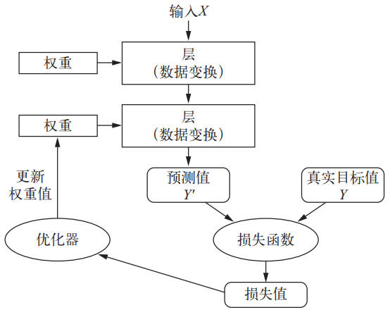

# Python深度学习[2018]

## 0. 深度学习基础

### 0.1 什么是深度学习

在经典的程序设计中（即符号主义人工智能，symbolic AI），人们输入的是规则和需要根据这些规则进行处理的数据，输出为答案。技术定义：在预先定义好的可能性空间中，利用反馈信号的指引来寻找输入数据的有用表示。

机器学习中，人们输入的是数据和从这些数据中预期得到的答案，系统输出规则。这些规则可应用于新的数据，使得计算机能够自主生成答案。

深度学习的核心概念是从人们对大脑的理解中汲取部分灵感得到的，但并没有证据表明大脑的学习机制与现代深度学习模型所使用的相同，技术定义：学习数据表示的多级方法。

### 0.2 机器学习简史

**概率建模**

probabilistic modeling，统计学原理在数据分析中的应用。

最有名的算法之一是朴素贝叶斯算法。其基于应用贝叶斯定理的机器学习分类器，假设输入数据的特征都是独立的；另一种分类算法是 logistic 回归 (logistic regression，简称 logreg)。

**核方法**

kernel method，是一组分类算法。最有名的是支持向量机 (SVM，support vector machine)。SVM 的目标是在两组不同类别的数据点间找到良好的决策边界 (decision boundary)。对于后续新的数据点，只需判断位于决策边界的那一侧即可。

SVM 通过两步寻找决策边界：

- 将数据映射到一个新的高维表示，此时决策边界可以用超平面表示
- 让超平面与每个类别最近的数据点之间的距离最大化，即间隔最大化 (maximizing the margin)

将数据映射到高维表示在实践中往往难以计算，这时就需用到核技巧 (kernel tirck)。基本的思想是：在新空间中利用核函数计算点对之间的距离，不需要在新空间中直接计算点的坐标。核函数是人为选择的，用于将原始空间中任意两点映射为两点在目标表示空间中的距离。

但 SVM 很难扩展到大型数据集，并且在图像分类等感知问题上的效果不好。

**决策树**

decision tree，类似于流程图。尤其是随机森林 (random forest) 算法，引入了一种健壮且实用的决策树学习方法：首先构建许多决策树，人后将它们的输出集成在一起。

对于任何浅层的机器学习任务来说，随机森林几乎总是第 2 好的算法。

梯度提升机 (gradient boosting machine) 也是将弱预测模型集成的机器学习技术。将梯度提升技术应用于决策树时，得到的模型与随机森林具有相似的性质，但大多数情况下好于随机森林。可以说，梯度提升机是处理**非感知**数据最好的算法之一。

### 0.3 深度学习的崛起

将复杂的多阶段流程替换为简单的、端到端的深度学习模型。

- 梯度提升机，用于浅层学习问题，处理结构化数据的问题，XGBoost 库；
- 深度学习，用于图像分类等感知问题，Keras 库；

**TPU（Tensor Processing Unit）张量处理器**，Google开发的专用集成电路，用于加速深层神经网络运算和机器学习。

## 1.神经网络的数学基础

### 1.1 现实的数据张量

- 向量数据：2D 张量 => (samples，features)
- 时间序列数据：3D 张量 => (samples，timesteps，features)
- 图像：4D 张量 => (sample，height，width，channels) 或 (samples，channels，height，width)
- 视频：5D 张量 => (samples，frames，height，width，channels) 或  (samples，frames，channels，height，width)

relu 运算和加法都是逐元素 (element-wise) 的运算，即运算独立地应用于张量中的每个元素。而这些运算非常适合大规模并行实现 (**向量化实现**)。

### 1.2 随机梯度下降-SGD

神经网络的每个权重参数都是空间中的一个自由维度，实际的网络中可能包含千万个参数，这样是无法做到将实际训练过程可视化的。

动量解决了 SGD 的两个问题：收敛速度和局部极小点，可以将优化过程想象成一个小球从**损失函数曲线**上滚下来。当小球的动量足够大时，则不会卡在峡谷中，最终到达全局最小点。

具体实现是：每一次移动小球，不仅要考虑当前的斜率值 (当前的加速度)，还要考虑当前的速度 (来自于之前的加速度)。即参数的更新不仅要考虑当前的梯度值，还要考虑上一次的梯度值。

## 2.神经网络入门

避免使用太小的中间层，以免再网络中造成信息瓶颈。因为中间神经元过少，会试图将大量信息压缩到维度很小的中间空间。

回归问题与 logistic 回归算法不同，logistic 是分类算法。

### 2.1准备数据

将取值范围很大的数据输入到神经网络中，学习会变得更加困难。最佳做法是对每个特征标准化：

输入数据的每个特征减去特征平均值，再除以标准差，最终得到的特征平均值为 0，标准差为1。**用于测试数据标准化的均值和标准差都是在训练数据上计算得到的。在工作流程中，绝不能使用在测试数据上计算得到的任何结果，即使标准化也不行。**

### 2.2 K 折交叉验证

对于数据很少的情况，划分的验证集会非常小。最佳做法是采用 K 折交叉验证：将数据划分为 K 个分区，K 通常取 4 或 5。实例化 K 个相同的模型，对每个模型在 K - 1 个分区上训练，剩下的一个分区上进行评估。最终模型的验证分数是 K 个验证分数的平均值。

