# TF_Notes

## 1.深度学习框架简介

### 1.1 Tensorflow

- Theano 是最早的学习框架之一，整体基于 Python 开发，支持 GPU 和 CPU 运算，但开发效率低、模型编译时间长，目前已停止维护。
- Keras 是基于 Theano 和 TensorFlow 等框架提供的底层运算而实现的高层框架，提供了大量快速训练、测试网络的高层接口。开发效率高，但缺少底层的实现，运行效率不高，灵活性一般。

Keras 可以看作一套高层 API 的设计规范，Keras 本身对这套规范有官方实现，TF 也实现了这套规范，称为 tf.keras 模块，并将 tf.keras 作为 TF 2.x 版本的唯一高层接口，避免出现接口重复冗余的问题。

TensorFlow 1.x 版本由 Google 于 2015 年发布，但开发调试困难，一度被业界诟病。直到 2019 年，Google 正式推出 TensorFlow 2.x 版本，避免了 TensorFlow 1.x 多种缺陷，采用动态图优先模式运行。但注意的是，TF 2.x 并不兼容 TF 1.x，二者在编程风格、函数接口设计等方面有很大的不同。

TF 2.x 采用**动态图(优先)模式开发**，调试方便，所见即所得。开发效率高，但运行效率低于静态图模式。TF 2.x 也支持通过 tf.function 将动态图优先模式的代码转化为静态图模式，同时取得较高的开发和运行效率。

**TF 框架的三大核心功能**

1. 加速计算：利用 GPU 加速
2. 自动梯度：无需手动编写导数的表达式，TF 可由函数的表达式自动求导
3. 常用神经网络接口：内建了常用神经网络计算、常用网络层、网络训练、模型保存于加载、网络部署等一系列深度学习系统的便捷功能。

### 1.2 Pytorch

- Torch 是一个优秀的科学计算库，基于 Lua 语言开发，灵活性高，容易实现自定网络层。

- Caffe 由贾扬清于 2013 年开发，主要面向卷积神经网络 (CNN) 的应用场合。基于 C++开发，支持 GPU 和 CPU，也提供了 Python 等语言的接口。

而 Pytorch 是 Facebook 基于 Torch 框架采用 Python 语言的深度学习框架。其借鉴了 Chainer 设计风格，采用命令式编程，使得搭接和调试网络非常方便。

2017 年正式发布，但由于 Pytorch 精良紧凑的接口设计，其在学术界获得了广泛好评。Pytorch 1.0 版本后，原来的 Pytorch 与 Caffe2 进行了合并，弥补了其咋工业部署方面的不足。

## 2.TF 基础

### 2.1 数据类型和数值精度

内部数据保存在张量上 (Tensor)，所有的操作 (Operation,OP) 也是基于张量对象进行的。

TF 中的数据类型包括：数值类型、字符串类型、布尔类型。

**数值类型** 

根据维度划分：

- 标量 (Scalar)：单个实数，维度为 0，shape=[ ]
- 向量 (Vector)：中括号包裹的 n 个数的有序集合，维度 1，shape = [n, ]
- 矩阵 (Matrix)：n 行 m 列实数的有序集合，维度 2，shape = [n, m]
- 张量 (Tensor)：dim > 2 的数组，维度/轴一般代表具体的物理意义

```python
#标量
a = tf.constant(1.2)
#向量
a = tf.constant([1.2])
a = tf.constant([1,2,3])
#字符串
a = tf.constant('TensorFlow hub')
```

**字符串类型**

`tf.string.lower()`，常见的字符串类型工具函数：`length(),split()` 等。

**布尔类型**

注意的是 TF 的布尔类型与 Python 的布尔类型不等价：

```python
a = tf.constant(True)
```

**数值精度**

一般使用 `tf.int32,tf.float32` 可满足。可在定义时指定精度类型，不满足则通过 `tf.cast` 转换：

```python
a= tf.constant(np.pi, dtype=tf.float16)
tf.cast(a, tf.double)
```

### 2.2 待优化张量

专门的数据类型来支持梯度信息的记录：`tf.Variable`。其在普通张量的基础上添加了 name，trainable 等属性。由于梯度运算消耗大量的计算资源，故需要通过 `tf.Variable` 包裹以便 TF 跟踪相关的梯度信息。

创建 Variable 对象默认启用优化标志，也可设置 trainable=False 来设置不需要优化。

### 2.3 创建张量

`tf.constant()` 和 `tf.convert_to_tensor()` 都可以自动将 Numpy 数组或者 Python 列表数据转化为 Tensor 类型，使用其一即可。

```python
tf.convert_to_tensor(np.array([[1, 2.],[3, 4]]))
```

- `tf.zeros()` 和 `tf.ones()`：创建全 0 或全 1张量
-  `tf.zeros_like(a)` 和 `tf.ones_like()` 可以很方便地创建于某个张量 shape 一致，当然也可通过 `tf.zeros(a.shape)` 实现

- `tf.fill(shape, value)`：创建自定义数值地张量
- `tf.random.normal(shape, mean=,stddev=)`：创建正态分布 $N(mean,stddev^2)$
- `tf.random.uniform(shape,minval=,maxval=,dtype=tf.float32)`：创建采样在 [minval, maxval) 区间地均匀分布张量
- `tf.range(limit, delta=)`：创建在 [0, limit) 之间，步长为 delta 地整型序列

### 2.4 张量的典型应用

**标量**

简单一个数字，维度 0，shape = [ ]。典型的用途是误差值的表示、各种测量指标的表示，如准确度 (Accuracy, acc)，精度 (Precision)和召回率 (Recall)等。

**向量**

如偏置向量 $b$，类型为 Variable，因为 $W,b$ 都是待优化参数。

**矩阵**

如**全连接层的**批量输入张量 $X$ 的形状：$[b, d_{in}]$，$b$ 表示输入样本数— Batch Size，$d_{in}$ 表示输入特征长度。

**三维张量**
$$
X=[b,\quad sequencelen,\quad feature len]
$$

- b：序列信号的数量；

- sequence len：序列信号在时间维度上的采样点或步数；
- feature len：表示每个点的特征长度；

在自然语言处理 (NLP) 的情感分类网络中，一般将单词通过嵌入层编码为固定长度的向量，如 "a" 编码为某个长度为 3 个向量，则等长的句子序列可表示为 shape= [2, 5, 3] 的形式。2 表示句子个数，5 表示单词数量，3 表示单词长度。

**四维张量**

用于保存特征图 (Feature maps) 数据，

一般定义为：$[b, h, w, c]$— 样本数，高，宽，通道数

### 2.5 索引与切片

**索引-支持两种方式**

```python
#第2张图片，第10行，第3列的数据
x = tf.random.normal([4, 32, 32, 3])
x[1, 9, 1]
x[1][9][1]
```

**切片**

`start:end:step`，[start, end)

```python
#以shape=[4,32,32,3]为例
#读取第一张图片的所有行
x[0,::] #与 x[0] 等价
```

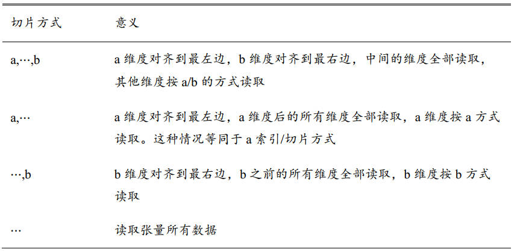

### 2.6 维度变换

**改变视图-reshape**

同一存储，在不同的角度下观察数据，可以从产生不同的视图，视图的产生是非常灵活的。在存储数据，内存都是以平铺的方式写入，维度的概念只是人为规定的为了管理方便。

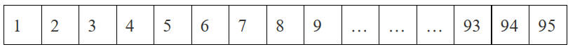

可通过 `x.ndim` 或 `x.shape` 获取张量的维度和形状列表。

在保证存储维度顺序性的前提下，可通过 `tf.reshape(x, new_shape)` 进行维度变换。

```python
#参数为-1表示当前轴长度需要张量总元素不变的法则自动推导
tf.reshape(x, [2,-1])
```

**增加维度**

增添长度为 1 的维度：数据不需改变，改变的只是理解方式。

如 shape=[28,28] 的灰度图片，末尾增加 1 维度，shape=[28,28,1]

`tf.expand_dims(x,axis)` 在指定的 axis 轴前插入**一个**新的维度

```python
x = [28,28]
x = tf.expand_dims(x,axis=2)
#x.shape=[28,28,1]

#x.shape=[1,28,28]
x = tf.expand_dims(x, axis=0)
```

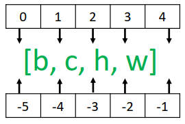

**删除维度**

只能删除长度为 1 的维度，不会改变张量的存储。`tf.squeeze(x, axis)`

```python
#x.shape=[1,28,28]
x = tf.squeeze(x, axis=0)

#不指定维度参数 axis，默认删除所有长度为 1 的维度
x = tf.squeeze(x)
```

**交换维度**

调整张量的存储顺序，改变了张量的视图。图片默认的格式为：`[b,h,w,c]`，但部分库图片的格式为通道先行模式：`[b,c,h,w]`，此时就需要完成维度交换 (Transpose)。

`tf.transpose(x,perm)` 函数完成维度交换操作，参数 `perm` 表示新维度的顺序 

```python
#原来的维度索引axis=[0,1,2,3]
#从[b,h,w,c]->[b,c,h,w]
x =tf.transpose(x, perm=[0,3,1,2]) #交换维度
```

需要注意的是，一定那维度交换完成后，则存储顺序完全改变，后续的操作都是基于交换后的顺序进行。

**复制数据**

通过 `tf.tile(x,multiples)` 函数完成数据在指定维度上的复制操作，mutiples 分别指定每个维度上的复制倍数，对应位置为 1 表示不复制，为 2 表示是原来长度的 2 倍。

```python
#在axis=0 维度复制1次；在 axis=1维度不复制
b= tf.constant([1,2])
tf.tile(b,multiples=[2,1])
```

`tf.tile()` 会创建一个新的张量来保存复制后的张量，复制操作涉及到大量的 IO 运算，计算代价相对较高。更推荐的是广播机制 (Broadcasting)。

**广播机制 (Broadcasting)**

一种**轻量级**的张量复制方法，Broadcasting 不会立刻复制数据，会在逻辑上改变张量的形状，使得视图变为复制后的形状，并通过深度学习框架的优化手段避免实际复制数据而完成逻辑运算。

尽管与 `tf.tile()` 的最终效果一样，但是 `Broadcasting` 机制节省了大量的计算机资源，提升了效率。

Broadcasting 只针对最常见的场景自动完成增加维度并复制数据，因为其机制的核心思想是普适性的—长度为 1 的维度。

### 2.7 数学运算

运算符号已经重载，可直接使用。

整除：`\\`；余除：`%`。

```python
a**(x)
tf.pow(a,x)
tf.square(a)#平方
tf.sqrt(a)#开方
tf.exp(a)#e^x
tf.math.log(a)#log_e(a)
```

**矩阵相乘**

通过 `@` 符号相乘；通过函数 `tf.matmul(a,b)` 实现。

注意：当张量的维度大于 2 时，TF 会选择最后两个维度的矩阵相乘，前面的维度都视作 Batch 维度。

## 3.TF 进阶

### 3.1 合并与分割

**合并**

通过拼接 (Concatenate) 和堆叠 (Stack) 的实现。

 `tf.concat(tensor, axis)` 函数拼接张量，不会产生新维度，仅在现有的维度上进行合并。

理论上，拼接合并操作可在任意维度上进行，唯一的约束都会非合并维度的长度必须一致。

`tf.stack(tensor, axis)`，当 axis ≥ 0 时，在 axis 之前插入；axis < 0 时，在 axis 之后插入。

```python
#拼接concat
tf.concat([a,b], axis=0)
#堆叠stack
a =tf.random.normal([35,8])
b =tf.random.normal([35,8])
tf.stack([a,b], axis=0)
#结果为 [2,35,8]
```

**分割**

`tf.split(tensor, num_or_size_splits, axis)`

- `num_or_size_splits` 为单个数值时，表示等长分割的份数；为 List 表示每份的长度
- `axis` 指定分割的维度索引号

```python
#x.shape=[10, 35, 8]
#在第 0 维度上分割成 4 份
result = tf.split(x, num_or_size_splits=[4,2,2,2], axis=0)
#len(reslut)=10
result[0].shape=[4,35,8]
result[1].shape=[2,35,8]
result[2].shape=[2,35,8]
result[3].shape=[2,35,8]
```

维度按长度为 1 的方式分割：

`tf.unstack(x, axis)`，切割长度固定为 1，只需要指定 axis 即可。

### 3.2 数据统计

**向量范数**

Vector Norm，表征向量长度。TF 中用来表示张量的权值大小、梯度大小。

TF 中，可以通过 `tf.norm(x,ord)` 求解张量的 $L_1,L_2,\infty$ 等范数

- $L_1$ 范数，向量 $x$ 的所有元素绝对值之和 $\displaystyle ||x||_1=\sum_i|x_i|$
- $L_2$ 范数，向量 $x$ 的所有元素平方和开根号 $||x||_2=\displaystyle \sqrt{\sum_i|x_i|^2}$
- $\infty$ 范数，向量 $x$ 所有元素绝对值的最大值 $\displaystyle ||x||_{\infty}=\max_i(|x_i|)$

```python
tf.norm(x,ord=np.inf)
tf.norm(x,ord=1)
```

**最值、均值、和**

`tf.reduce_max,tf.reduce_mean,tf.reduce_sum`

不指定 axis 的时候，会自动求解出全局元素相关的值。

`tf.argmax(x,axis)` 和 `tf.argmin(a,axis)` 求解 axis 轴上，x 最大子、最小值所在的索引号。

**张量比较**

`tf.equal(a,b)` 或 `tf.math.equal(a,b)` 比较 2 个张量是否相等。

### 3.3 填充和复制

**填充—padding**

`tf.pad(x,paddings)`

```python
x=tf.random.normal([4,28,28,1])
#填充长宽,上下左右填充2个单元
tf.pad(x,[[0,0],[2,2],[2,2],[0,0]])

#复制,图片数复制一份，高宽复制一份，通道深度不管 
tf.tile(x,[2,3,3,1])
```

**复制**

`tf.tile(x,multiples)`

**限幅**

- `tf.maximum(x,a)`，即 $x \in [a, +\infty)$
- `tf.minimum(x,a)`，即 $x \in (-\infty,a]$

### 3.4 高级操作

1.**`tf.gather(x,index_list,axis)`** ：实现根据索引号收集数据的目的。

非常适合收集索引号不规则的集合，而切片操作的索引号规则。

假设有 4 个班级，每个班级 35 个学生，8 门科目，shape = [4,35,8]，查找每个班级第 1 、4、9 学生的成绩：

```python
tf.gather(x, [0,3,8], axis=1)
#索引号乱序排列，收集的数据也是对应的顺序
tf.gather(x, [3,1,0], axis=0)
```

2.**`tf.gather_nd(x,indices_list)`**：通过指定每次采样点的多维坐标来实现采样多个点。

如抽查第 2 个班级第 2 个同学的所有科目，第 3 个班级第 3 个同学的所有科目，第 4 个班级第 4 个同学的所有科目，则这 3 个采样点索引坐标为：
[1,1]，[2,2]，[3,3]

```python
#x.shape=[4,35,8]
tf.gather_nd(x,[[1,1],[2,2],[3,3]])
```

3.**`tf.boolean_mask(x,mask_lsit,axis)`**：给定掩码 (Mask) 方式采样。

掩码采取：mask = [True,Fasle,False,True]，采样第 1 和第 4 个班级的数据，注意掩码的维度需与对应维度长度一致。

**tf.boolean_mask 与 tf.gather 类似，一个通过掩码方式，一个通过索引号采样。**

4.**`tf.where(cond,a,b)`**：可根据 cond 条件的真假从参数 a 或 b 中读取数据。

- conda 为 True，则 a
- conda 为 False，则 b

当参数 a=b=None 时，即参数 a，b 不指定，`tf.where` 会返回 cond 张量中所有 True 的元素索引坐标。

```python
#提取张量中所有正数的数据和索引
x= tf.rand.normal([3,3])
#获取对应的掩码值
mask= x > 0
#提取正数
int_num = tf.boolean_mask(x, mask)
#提取正数的索引
int_indices = tf.where(mask)
```

**5.`scatter_nd(indices,updates,shape)`**：高效刷新张量的部分数据，而其只能在全为 0 的白板张量上执行刷新操作。


```python
#新数据的位置参数
indices = tf.constant([4],[3],[1],[7])
#需要写入的数据
updates = tf.constant([4.4, 3.3, 1.1, 7.7])
#在长度为 8 的全 0 张量上刷新
tf.scatter_nd(indices, updates, [8])
```

**`tf.meshgrid()`**：方便生成二维网格的采样坐标，便于可视化。

### 3.5 经典数据集加载

在 TF 中，`keras.datasets` 模块提供了常用经典数据集的自动下载、管理、加载与转换功能。并提供了 `tf.data.Dataset` 数据集对象，方便实现多线程，预处理，随机打散和批训练等常用数据集功能。

- Boston Housing，波士顿房价趋势数据集，用于回归模型训练和测试
- CIFAR 10/100，真实图片数据集，用于图片分类任务
- MNIST/Fashion_MNIST，手写图片数据集，用于图片分类任务
- IMDB，感情分类任务数据集，用于文本分类任务

**`datasets.xxx.load_data()` 函数实现经典数据集自动加载**，如 MNIST 数据：

```python
#记载数据集
(x,y), (x_test, y_test)=datasets.mnist.load_data()
print("x：{0},y：{1},x_test：{2},y_test：{3}".format(x.shape, y.shape, x_test.shape, y_test.shape))
#数据加载后，需要转换为 Dataset对象
train_db = tf.data.Dataset.from_tensor_slices((x, y))
```

数据加载并转换为 Dataset 对象后，执行数据集的标准处理步骤

```python
# 1.随机打散，返回一个 Dataset 新对象
# Dataset.shuffle(buffer_size),其中buffer_size参数指定缓冲池的大小
train_db = train_db.shuffle(10000) #随机打散样本，但是不打散样本与标签的映射关系

# 2.批训练，同时计算多个样本
# 一次并行 128 个样本数据，数量大小根据显存配置
train_db = train_db.batch(128)

#3.预处理自定义函数
# 预处理，使得数据集的各式满足模型的输入要求
def preprocess(x, y):
    """
    自定义预处理函数
    参数：
    x -- 待处理的数据集,维度[b,28,28]
    y -- 待处理的数据集,[b]

    返回值：
    x -- 标准化和扁平化后的 x
    y -- 转换为 one_hot 向量
    """
    x = tf.cast(x, dtype=tf.float32) / 255. #标准化0-1
    x = tf.reshape(x, [-1, 28*28]) #扁平化

    y = tf.cast(x, dtype=tf.int32)
    y = tf.one_hot(y, depth=10)

    return x,y
train_db = train_db.map(preprocess)
```

## 4.神经网络

### 4.1 全连接层

感知机 (Perception) 模型，感知机为代表的线性模型不能解决亦或 (XOR) 等线性不可分问题。

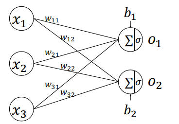

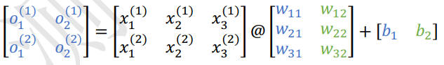

每个**输出节点与全部的输入节点相连**接，这种网络层称为全连接层 (Fully-connected Layer)，或者稠密连接层 (Dense Layer)。

**张量方式实现**

```python
o1 = tf.matmul(x, w1)+b1
o1 = tf.nn.relu(o1)
```

**层方式的实现**

更高层、使用更方便的层实现方式：`layers.Dense(units,activation)`

```python
from tensorflow.keras import layers
x = tf.random.normal([4,28*28])
#创建全连接层，指定输出节点数和激活函数
fc =layers.Dense(512, activation=tf.nn.relu)
#获取权值矩阵
fc.kernel
#获取偏置张量
fc.bias
#返回待优化参数列表
fc.trainable_variables
#返回所有参数列表
fc.variables
```

### 4.2 神经网络

神经网络的前向传播过程是：数据张量 (Tensor) 从第一层流动 (Flow) 至输出层的过程，前向传播最后一步完成误差的计算。

误差反向传播 (Backward Propagation，BP) 算法求解梯度信息，同时用 (Gradient Descent，CD) 算法迭代更新参数。

对于回归问题，除了用 MSE 均方误差衡量模型的测试性能，还可以用平均绝对误差 MAE 衡量模型的性能。

## 5.反向传播算法

### 5.1 激活函数的导数

Backpropagation，简称 BP。反向传播算法在 1960 年早期被提出，并未引起重视。直到 1986 年，Geoffrey Hinton 等人在神经网络上应用了反向传播算法。

**sigmoid**
$$
\sigma(x)=\frac{1}{1+e^{-x}}\\
\frac{d}{dx}\sigma(x)=\sigma(1-\sigma)
$$
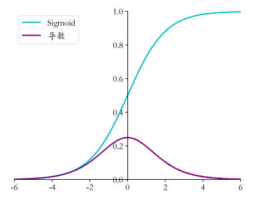

```python
import numpy as np
def sigmoid(x):
    return 1 / (1 + np.exp(-x))
def derivative(x):
    return sigmoid(x) * (1-sigmoid(x))
```

**ReLU**
$$
ReLU(x)=\max(0,x)\\
\frac{d}{dx}ReLU=    
\left\{
    \begin{aligned}
         & 1 & x \ge 0     \\
         & 0 & x < 0
    \end{aligned}
  \right.
$$
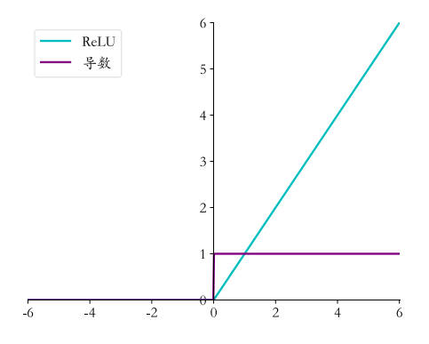

```python 
def relu(x):
    return np.maximum(0,x)
def derivative(x):
    d=np.array(x, copy=True)
    d[x < 0] = 0
    d[x >= 0] = 1
    return d
```

**LeakyReLU**

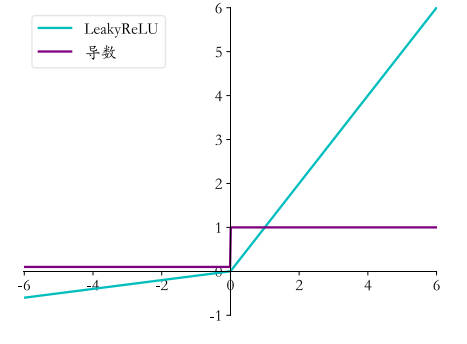

```python
def derivate(x, p):
    dx = np.ones_like(x)
    dx[x < 0] = p
    return dx
```

**Tanh**
$$
\tanh=\frac{e^x-e^{-x}}{e^x+e^{-x}}
$$
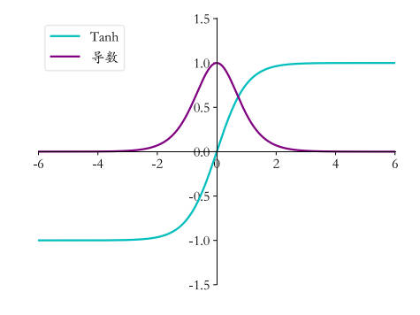

```python
def sigmoid(x):
    return 1 / (1 + np.exp(-x))
def tanh(x):
    return 2 * sigmoid(2 * x) -1
def derivative(x):
    return 1 - tanh(x) ** 2
```

### 5.2 自动求导

利用 TF 自动求导求出函数在 $x,y$ 的偏导数，并循环更新：

```python
x=tf.constant([4., 0.])
#循环优化200次
for step in range(200):
    #梯度跟踪
    with tf.GradientTape() as tape:
        tape.watch(x) #加入梯度跟踪列表
        y = himmelnlau(x) #前向传播
    grads = tape.gradient(y, [x])[0] #反向传播
    x = x - 0.01 * grads
```

Gradient 非常消耗显存，每次会运行一次操作，而后释放资源。如果需要运行多次，则需要设置为：
```python
# with tf.GradientTape(persistent=True) as tape:
# 高阶导的实现方式
with tf.GradientTape() as t1:
    with tf.GradientTape() as t2:
        y = x * w +b
    dy_dw, dy_db = t2.gradient(y, [w, b])
d2y_dw2 = t1.gradient(dy_dw, w)
```


## 6.keras 高层接口

在 TF 2 版本中，keras 被正式确定为 TF 的高层唯一接口 API，取代了 TF 1 版本中自带的 `tf.layers` 等高层接口。

### 6.1 网络容器

通过 Keras 提供的网络容器 Sequential 将多个网络层封装成 一个大型网络，只需调用网络模型的实例一次即可完成数据从第一层到最后一层的顺序传播运算。

```python
from tensorflow.keras import layers,Sequential
network = Sequential([
    layers.Dense(3, activation=None),
    layers.ReLU(),
    layers.Dense(3, activation=None),
    layers.ReLU()
])
x = tf.random.normal([4,3])
out = network(x)

# 另一种方法
model = tf.keras.Sequential()
model.add(tf.keras.layers.Dense(8))
model.add(tf.keras.layers.Dense(4))
# 创建网络层参数
model.build(input_shape=(5,5))
# 通过summary()函数打印网络结构和参数量
model.summary()
```

###  6.2 模型装配与训练

在 keras 中，有 2 个比较特殊的类：keras.Model 和 keras.layers.Layer 类。

- `keras.layers.Layer` 类是网络层的母类，定义了网络层一些常见的功能，如添加权值、管理权值列表等。
- `keras.Model`  是网络的母类，除了 `Layer` 类的功能外，还有保存模型、加载模型、训练和测试模型等功能，其中 `Sequential` 就是 `Model` 的子类。

**装配**

通过 complie 函数指定使用的优化对象、损失函数类型等：

```python
from tensorflow.keras import optimizers, losses
# 采用 Adam 优化器，学习率为 0.01，交叉熵损失函数(包含softmax)，测定指标为准确率
model.compile(optimizer=optimizers.Adam(learning_rate=0.01),loss=losses.CategoricalCrossentropy(from_logits=True),metrics=['accuracy'])
```

**训练**

```python
#指定训练集为 train_db，验证集为 val_db，训练 5 个epochs，每 2 个epoch验证一次
#返回训练的轨迹信息保存在 his_log 中
his_log = model.fit(train_db, epochs=5, validation_data=val_db, validation_freq=2)
```

训练中产生的历史数据可以通过返回值对象取得。通过 compile 和 fit 方式实现的代码非常简洁和高效，大大缩减了开发时间。但注意的是，由于接口非常高层，灵活性也相应的降低。

**预测**

`Model.predict(x)` 方法可以完成模型的预测

```python
model.predict(x)#模型预测
# 简单地测试模型的性能，可通过循环测试完 db 数据集上的所有样本
model.evaluate(db_test)
```

### 6.2 模型的保存

**张量保存方式**

在拥有网络结构源文件的条件下，直接保存网络张量参数到文件系统上是最轻量级的一种方式。但是它需要使用相同的网络结构才能正确恢复网络状态，**一般在拥有相同网络源文件的情况下使用。**

```python
# 可将当前的网络参数保存在 path 文件中
model.save_weights(path)
# 从参数文件中读取数据并写入当前网络
model.load_weights(path)
```

**网络方式**

不需要神经网络的源文件，仅仅需要模型参数文件即可恢复出网络模型。即不用提前创建模型即可从文件中恢复出网络  model 对象。

```python
#保存模型结构与模型参数到文件
model.save('model.h5')
#从文件恢复网络结构与网格参数
model =keras.models.load_model('model.h5')
```

**SaveModel 方式**

将模型部署到其他平台上时，采用 TF 提出的 SaveModel 方式更具有平台无关性。

```python
tf.saved_model.save(model, 'model_savemodel')
#恢复网络结构与网络参数
model = tf.saved_model.load('model_savemodel')
```

### 6.3 自定义网络层

在创建自定义**网络中的网络层类时**，需要继承 `layers.Layer` 基类；创建自定义**网络类时**，需要继承自 `keras.Model` 基类，从而能够利用 `Layer/Model` 基类提供的参数管理等功能，同时也可与其他标准网络层类交互使用。

对自定义的网络层，至少需要实现初始化 `__init__` 方法和前向传播逻辑 `call` 方法。**下面实现的为无偏置的全连接层。**

1. **类的初始化工作**：创建继承自 Layer 基类的自定义类。创建初始化方法，并调用父类的初始化函数，此处设置的为全连接层。

   ```python
   #如MyDense(4,3) 创建输入为4，输出为3
   class MyDense(layers.Layer):
       def __init__(self, input_dim, output_dim):
           super(MyDense, self).__init__()
           #权值张量 w 创建,设置需要优化
           self.kernel = self.add_variable('w', [input_dim, output_dim], trainable=True)
           ed
   ```

2. **设计自定义类的前向传播逻辑**，设置激活函数为：ReLU

   `training=True` 时执行训练模式，否则执行测试模式，默认为测试模式。对于此处的全连接层，其训练模式和测试模式的逻辑一致，不需要额外的处理。

   ```python
   	def call(self, inputs, training=None):
           #此处不考虑偏置b，即b=0
           #out = np.dot(input, self.kernel)
           out = inputs @ self.kernel
           out = tf.nn.relu(out)
           return out
   ```

### 6.5 自定义网络

基于上述自定义的”无偏置的全连接层“来实现基于 MNIST 网络模型的创建。

```python
model = Sequential([MyDense(784, 256),
                    MyDense(256, 128),
                    MyDense(128, 64),
                    MyDense(64, 32),
                    MyDense(32, 10)
                   ])
model.build(input_shape(None, 20*28))
model.summary()
```

Sequential 容器适用于按顺序规律传播的网络模型，对于复杂的网络结构，则使用自定义网络更加灵活。

**创建自定义网络类**

```python
#创建网络类，继承自 Model基类
class MyModel(keras.Model):
    def __init__(self):
        super(MyModel, self).__init__()
        #完成网络层的创建
        self.fc1 = MyDense(784, 256)
        self.fc2 = MyDense(256, 128)
        self.fc3 = MyDense(128, 64)
        self.fc4 = MyDense(64, 32)
        self.fc5 = MyDense(32, 10)
```

### 6.6 常见模型

如 ResNet，VGG等，可直接从 **keras.applications** 子模块中通过一行代码即可创建并使用，此处以 ResNet 为例：

利用 Keras 加载 ImageNet 预训练好的 ResNet50 网络：

```python
#去掉最后一层
resnet = keras.applications.ResNet50(weights='imagenet', include_top=False)
resnet.summary()

#测试网络的输出
#out.shape=[b, 7, 7, 2048]
x = tf.random.normal([4, 224, 224, 3])
out = resnet(x)
```

对于具体的任务，需设置自定义输出节点数，如 100 分类，此时需要新建池化层，将特征从 [b, 7, 7, 2048] 降维到 [b, 2048]。

```python
#新建平均池化层
global_average_layer = layers.GlobalAveragePooling2D()
x = tf.random.normal([4, 7, 7, 2048])
#[4, 7, 7, 2048]->[4, 1, 1, 2048]
#维度删减后变为[4, 2048]
out = global_average_layer(x)

#新建全连接层,输出为100个节点
fc = layers.Dense(100)
x = tf.random.normal([4, 2048])
#获得100个类别的概率分布
out = fc(x)
```

最终用容器封装成一个新的网络：

```python
#ResNet50子网络，池化层，全连接层
mynet = Sequential([resnet, global_average_layer, fc])
mynet.summary()
```

**通过 resnet.trainable = False 可选择冻结 ResNet 部分的网络参数，只训练新建的网络层，从而快速高效完成模型的训练。**

具体案例可看：[风格转换.ipynb](ref_files/风格转换.ipynb)

### 6.7 测量工具

网络训练过程中，需要统计准确率，召回率等。Keras 提供相关的测量工具，都在 `keras.metrics` 模块中，专门用于统计训练过程中的指标数据。

测量工具使用的 4 个步骤：

**1.新建测量器**

keras,metrics 提供了多种测量类。如平均值的 Mean 类，统计准确率的 Accuracy 类，统计余弦相似度的 CosineSimilarity 类等。

在前向运算中，会得到每一个 Batch 的平均误差。如果希望得到每个 Step 的平均误差，可选择 Mean 测量器：

**2.写入数据**

通过测量器的 update_state 函数可以写入新的数据

**3.读取统计信息**

采样多次数据后，可选择在需要的地方调用测量器的 result() 函数，来获取统计值。

**4.清除状态**

测量器会统计所有历史记录的数据。在新一轮统计中，需要清除历史状态，通过 reset_states() 即可实现清除状态功能。从而开始下一轮的统计。

```python
#1.新建平均测量器
loss_meter = metrics.Mean()

#2.记录采样的数据，通过 flooat()函数将张量转换为普通数值
#放置每个 Batch 运算结束后，测量器会自动根据采样的数据统计平均值
loss_meter.update_state(float(loss))

#3.读取统计信息,间隔性统计 loss 均值
print(step, 'loss', loss_meter.result())

#4.清除状态
if step % 100 == 0:
    print(step, 'loss:', loss_meter.result())
    loss_meter.reset_states()
```

**准确率测量**

每次前向计算完成后，记录训练准确率数据。Accuracy 类的 update_state 函数的**参数为预测值和真实值**。

```python
# 新建准确率测量器
acc_meter = metrics.Accuracy()
out = model(x)
#经过argmax后的预测值
pred = tf.argmax(out, axis=1)
pred = tf.cast(pred, dtype=tf.int32)

#根据预测值和真实值写入测量器
acc_meter.update_state(y, pred)
print(step, 'Evaluate Acc', acc_meter.result().numpy())
acc_meter.reset_states()
```

### 6.8 可视化

官方指导：https://tensorflow.google.cn/guide/intro_to_graphs

在网络训练过程中，通过 Web 端远程监控网络的训练进度。TF 提供了一个专门可视化的工具 `TensorBorad`，通过 TF 将监控数据写入到文件系统，并利用 Web 后端监控对应的文件目录，从而实现远程查看网络数据。

**模型端**

创建监控数据的 Summary 类，在需要的时候写入监控数据—误差数据。

```python
#通过tf.summary.create_file_writer创建监控对象实例
#创建监控类，并写入 log_dir目录
summary_writer = tf.summary.create_file_writer(log_dir)
with summary_wirter.as_default():
    #当前时间戳 step 上的数据为loss，写入到 train-loss数据库中
    tf.summary.scalar('train-loss', float(loss), step=step)
```

图片类型的数据：

```python
with summary_writer.as_default():
    tf.summary.scalar('test-acc', float(total_correct/total), step=step)
```

**浏览器端**

运行程序时，监控数据被写入到指定文件目录中。如果实时远程查看，需借助浏览器和 Web 后端监控的文件目录 path，即可打开 Web 后端监控进程。

- 通过 `cmd` 运行 `tensorboard --logdir files_save_path`，

- 目前 VsCode 也支持直接打开 tensorboard：按 `shift+p` 快捷键，输入 `tensorboard` 启动即可

可视化示例：[可视化示例.py](ref_files/可视化示例.py)

标量监控界面：SCALARS、图片可视化页面 IMAGES等。

[**Visdom**](https://github.com/fossasia/visdom)：除了 TensorBoard 工具外，Facebook 开发的 Visdom 更加丰富，它可以接收 PyTorch 的张量类型数据，但不能接收 TF 张量类型数据，需要转换为 Numpy 数组。

## 7.过拟合

机器学习的主要目的是从训练集上学习到数据的真实模型，从而能够在未见过的测试集上表现良好，即泛化能力。一般来说，测试集和训练集都采样自相同的数据分布，但样本是相互独立的，即称为独立同分布假设 (i.i.d)。

### 7.1 模型的容量

模型的容量，主要指模型拟合复杂函数的能力。一种体现模型容量的指标是模型假设空间的大小，即模型可以表示的函数集的大小。(1 次多项式的模型空间、5 次多项式的模型空间)

过大的假设空间会增加搜索的难度和计算代价，因为较大的假设空间可能包含大量表达能力过强的函数，**能够将训练样本的观测误差也学习进来，从而伤害了模型的泛化能力。**

**如何选择合适容量的学习模型**

VC (Vapnik-Chervonenkis 维度)是一个应用比较广泛的度量函数容量的方法，**可以给机器学习提供一定程度的理论保证，但很少应用到深度学习中。**一部分原因是神经网络过于复杂，很难确定网络结构背后数学模型的 VC 维度。

### 7.2 数据集的划分

- 训练集 (Train set) 用于训练模型参数
- 测试集 (Test set) 用于测试模型的泛化能力
- 验证集 (Validation set) **用于选择模型参数**

设计人员可以根据验证集的表现来调整模型的各种超参数的设置，提升模型的泛化能力。但是测试集的表现不能用来反馈模型的调整，否则测试集上的性能将无法代表模型的泛化能力。

为了避免将测试集当作验证集使用，表现出的 “伪泛化性能” **可选择多个测试集**。

**早停 (Early Stopping)**

一般将训练集中的一个 Batch 运算更新一次叫做一个 Step，对训练的所有样本循环一次为 Epoch。**一般建议在几个 Epoch 后进行验证集的运算。**


由于网络实际容量可以随着训练的进行发生改变，因此随着网络训练的进行，可能观测到不同的过拟合、欠拟合状况，选择合适的 Epoch 提前停止训练可以避免过拟合的现象。

具体的，对于分类问题，我们可以记录模型验证的准确率。

### 7.3 正则化

网络模型可以为优化算法提供初始的函数假设空间，但是模型的实际容量可以随着网络参数的优化更新而产生变化。因此通过限制网络参数的稀疏性，可以用来约束网络的实际性能。

一般可通过在损失函数上添加**参数稀疏性惩罚项**实现，而参数的稀疏性约束常通过约束参数的 $L$ 范数实现。此时新的优化目标为：**最小化原来的损失函数，约束网络参数的稀疏性。**二者的权重关系通过参数 $\lambda$ 来实现，较大的 $\lambda$ 意味着网络稀疏性更加重要，反之则网络的训练误差更加重要。

- $L_0$ 正则化：$L_0$ 范数表示非零元素的个数，不可导从而无法进行梯度下降
- $L_1$ 正则化：也叫做 Lasso Reularization，所有元素的绝对值之和，连续可导

- $L_2$ 正则化：所有元素的平方和，也叫做 Ridge Regularization，连续可导

  ```python
  w1 = tf.random.normal([4,3])
  w2 = tf.random.normal([4,2])
  #L1正则化项
  loss_reg_L1 = tf.reduce_sum(tf.math.abs(w1)) + tr.reduce_sum(tf.math.abs(w2))
  #L2正则化
  loss_reg_L2 = tf.reduce_sum(tf.square(w1)) + tr.reduce_sum(tf.square(w2))
  ```

根据实验，随着正则化系数 $\lambda$ 的增加，网络对参数稀疏性的惩罚变大，迫使优化算法搜索让网络容量更小的模型。实际训练中，一般从较小的 $\lambda$ 开始，然后逐渐增大。

### 7.4 Dropout

通过随机断开神经网络的连接，减少每次训练时实际参与计算的模型参量。但在测试时，Dropout 会恢复所有的连接。

```python
#添加 dropout 操作，断开率为0.5
x = tf.nn.dropout(x, rate=0.5)
#或当作网络层添加 dropout层，断开率为 0.5
model.add(layers.Dropout(rate=0.5))
```

随着 Dropout 层的增加，网络模型训练时的实际容量减少，泛化能力增强。

### 7.5 数据增强

增加数据集也是解决过拟合最重要的途径，但数据是很贵的。因此在有限的数据集上，可通过数据增强技术增加训练的样本数量。**数据增强 (Data Augmentation)** 是指在维持样本标签不变的情况下，根据先验知识改变样本特征，使得新产生的图片也符合或近似符合数据的真实分布。

对于图片数据，进行旋转、缩放、平移、裁剪、改变视角、遮挡局部区域等都不会改变图片的主体标签类别。

TF 提供了常用的图片处理函数，位于 `tf.image` 子模块中：

```python
# 设置预处理模块
def preprocess(x, y):
    """
    参数：
    x -- 图片路径
    y -- 图片的数字编码
    """
    x = tf.io.read_file(x)
    x = tf.image.decode_jpeg(x, channels=3)
    #图像缩放到 244×244 大小
    x = tf.image.resize(x, [244, 244])
```

**旋转**

```python
#旋转 k 个90度，此处为 180 度
tf.image.rot90(x, k=2)
```

**翻转**

沿着水平轴和竖向轴翻转

```python
#随机水平翻转
tf.image.random_flip_left_right(x)
#随机竖直翻转
tf.image.random_flip_up_down(x)
```

**随机裁剪**

在原图的左右或上下方向去掉部分边缘像素，保持主体大小不变。实际操作中，一般将图片放大使其略大于原始图片，在裁剪到合适的大小

```python
x = tf.image.resize(x, [244,244])
x = tf.image.random_crop(x, [244, 244, 3])
```

**生成数据**

通过生成模型在原有的数据上进行训练，学习到真实的数据分布，从而利用生成模型获得新的样本。一定程度上也可以提高网络的性能，如条件生成对抗网络 (Conditional GAN,CGAN)，可以生成带标签的样本。

## 8.卷积神经网络

### 8.1 局部相关性

全连接网络参数量过大，尤其是针对图像领域。当网络层的每个输出节点都与所有的输入节点相连接 (如下图)，这种稠密的连接方式是全连接层参数量大、计算代价高的根本原因。因此，全连接层也被称为稠密连接层 (Dense Layer)。

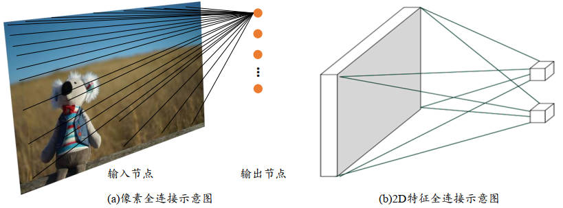

将连接简化，根据重要性选择一部分的输入节点与输出节点连接，而一般衡量重要性的标准有位置或距离。

其中基于距离重要性分布的假设特性称为局部相关性，即只关注距离自己较近的部分节点。在局部相关性的先验下，采取简化的 “局部连接层”，对于窗口 $k × k$ 内的所有像素，使用权值相乘累加的方式提取特征信息，每个输出节点提取对应窗口区域的特征信息。

选中的窗口元素与卷积核对应元素相乘采用**哈达马积 (Hadamard Product) $\odot $**，与矩阵相乘不同。

步长 (strides，s) 控制信息的提取密度。

多通道，单卷积核：

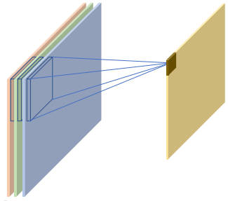

多通道，多卷积核：

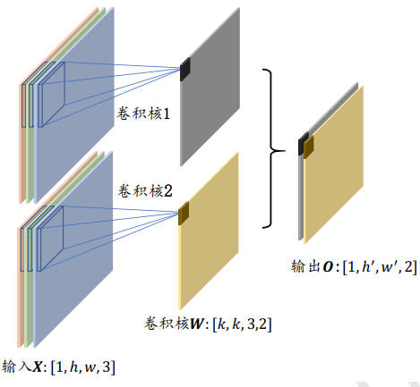

### 8.2 卷积层的实现

**自定义权值**

自定义权值，通过 `tf.nn.conv2d` 函数可以方便实现 2D 卷积运算：

```python
# 2样本，5×5，3通道,[m, h, w, c]
x = tf.random.normal([2, 5, 5, 3])
# 4个 3×3 大小的卷积核
w = tf.random.normal([3, 3, 3, 4])
# padding=[[0,0],[上，下],[左，右],[0,0]]
#此处各填充一个单位
out = tf.nn.conv2d(x, w, strides=1, padding=[[0,0],[1,1],[1,1],[0,0]])
```

**卷积层类**

通过卷积层类：`layers.Conv2D` 可以直接调用类的实例完成卷积层的前向计算。

**在 TF 中，API 命名具有规律性。首字母大写的一般表示类，全部小写的一般表示函数。使用类的方式会(在创建类时或 build 时)自动创建权值和偏置张量，简单方便，单灵活性差。**

```python
layer1 = layers.Conv2D(4, kernel_size=(3, 4), strides=(2, 1), padding='SAME')
# 创建完成后，通过调用实例(的 __call__ 方法)即可完成前向计算
# 即实例化的同时完成前向计算
out = layer(x)
# 返回待优化张量列表
layer.trainable_variables

# 也可以直接调用访问权值 W 和 b
layer.kernel
layer.bias
```

**池化层**

无学习参数，可有效减低特征图的尺寸，**如窗口尺寸 2×2，步长 2，可实现输出只有输入高宽一半的目的**。

### 8.3 LeNet-5 实战

Yann LeCun 等人提出的用于手写数字和机器打印字符图片识别的神经网络。

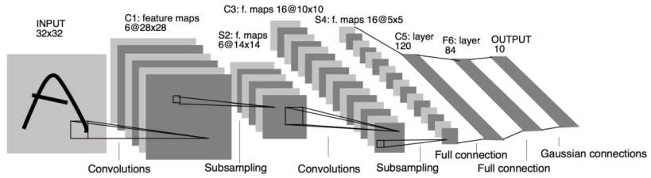

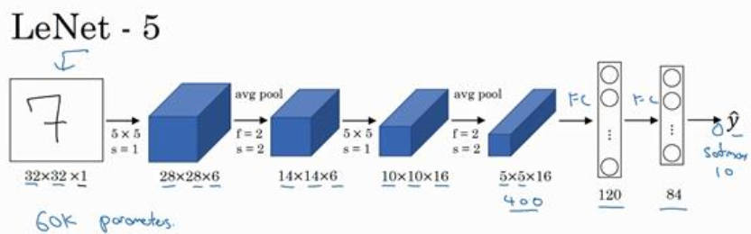

流程：

[32, 32, 1] 卷积操作$\rightarrow$ [b, 28, 28, 6] 下采样层(平均池化) $\rightarrow$ [b, 14, 14, 6] 

卷积操作$\rightarrow$ [b, 10, 10, 16]下采样层(平均池化) $\rightarrow$ [b, 5, 5, 16]

 $\rightarrow$ [b, 400] $\rightarrow$ 送到**输出节点**分别为 $120,84$ 的全连接层

为了使其更加容易在深度学习框架上实现，对 LetNet 进行改进：

- 输入变为 [28, 28 ,1]
- 平均池化改为最大池化
- 用全连接层替换掉最后的 Gaussian connections 层

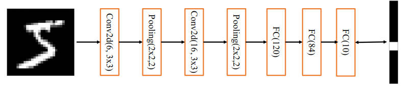

具体见：[LetNet-5实战.ipynb](code\chapter08\LetNet-5实战.ipynb)

### 8.4 BatchNorm 层

随着网络加深使得网络训练变得不稳定，甚至出现网络长时间不更新甚至不收敛的现象。应对这种情况，15 年 Google 研究人员提出了参数标准化的手段 (Normalize)，设计出了 Batch Normalization (BatchNorm, BN) 层。

BN 层使得网络超参数的设定更加自由，收敛速度更快，性能更好。

**Conv (卷积层) -  BN - ReLU - 池化层一度成为网络模型的标配单元块。**

通过应用可以发现，网络层输入 $x$ 分布相近，且分布在较小的范围内时，更有利于函数的优化。


**不同的标准化方式**

- BN：在通道 c 上计算每个通道上所有数据的 $\mu_B, \sigma^2_B$

```python
x = tf.reshape(x, [-1,3])
mu_b = tf.reduce_mean(x, axis=0)
```

**BN:[m, c, h*w]，如 6  个样本，3 个数据 [6, 3, 784]。统计每个通道上所有样本的 mean, std。**

- Layer Norm：统计每个样本的所有特征的均值和方差
- Instance Norm：统计每个样本的每个通道上的特征均值和方差
- Group Norm：将 c 通道分成若干组，统计每个样本组内的均值和方差

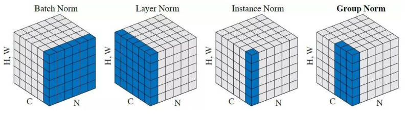

```python
#默认参数：axis=-1 最后一个轴（如卷积最后一个层为通道层）,center=True,scale=True,trainable=True
#z=γ×z+β ,center=>β，scale=>γ
#trainable=True,γ，β是否需要反向传播优化
net = layers.BatchNormalization()

#训练时和测试时的模式不同
#测试模式下，training=None,moving_mean,moving_std 以及在训练集训练好的 γ，β都不变
net(x, training=None)
```

好处：

- Converge faster (收敛速度更快)
- Robust，训练更加稳定


### 8.5 经典卷积网络

**AlexNet**

12 年，AlexNet ：5 个卷积层，3 个全连接层，每个卷积层后添加 Max Pooling 层，降低特征图的维度。

- 采用了 ReLU 激活函数
- 引入了 Dropout 层
- 池化层 3×3，s=2
- 卷积核 7×7

**VGG 系列**

14年，ILSVRC14 亚军牛津大学 VGG 实验室相继提出 VGG 系列模型:

- 卷积核 3×3，参数量少
- 更小的池化层 2×2，s=2

VGG 系列网络结构：

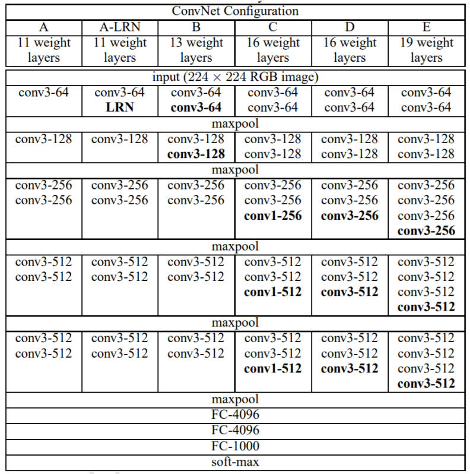

**GoogleNet**

14年，ILSVRC14 冠军 Google 提出了 GoogleNet 模型，层数 22 层。

- 采用 1×1 和 3×3 卷积核
- 参数量小，性能更好

- 采用模块化设计，堆叠 Inception 模块

**CIFAR10**

CIFAR10 图片分辨率仅为 32×32，使得部分主体信息较为模糊。此处根据 VGG13 网路完成图片识别：

- 将 VGG 原来 224×224 的输入调整为 32×32
- 3 个全连接层维度调整为 [256, 64, 10]，满足 10 分类任务设定

### 8.6 卷积层的变种

卷积核小则提取到的网络特征有限，而增大卷积核则会增加网络的参数量和计算代价，因此需权衡设计。

**空洞卷积 (Dialated/Atrous Convolution)**

在普通卷积的基础上增加 Dilation 参数，用于控制卷积核单元内的距离。参数增大会使得窗口的区域增大，但实际参与运算的点数仍然保持不变。

通过`layers.Conc2D(1, kernel_size=3, strides=1, dilation_rate=2)` 可设置

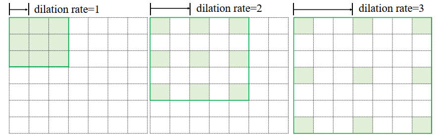

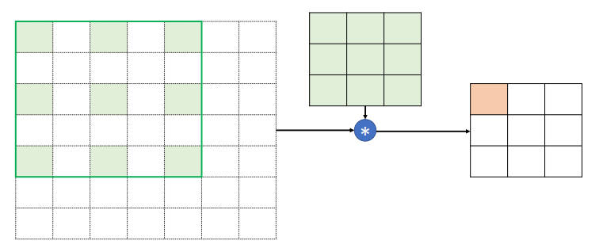

**转置卷积(Transposed Convolution/Fractionally Strided Convolution)**

部分资料称作反卷积/Deconvolution，但不能单纯地看作普通卷积的逆过程。二者仅能恢复对方等形状的张量，但具体数值并不相等。

通过在输入之间填充大量的 padding 来实现输出高度大于输入高度，实现**向上采样的目的**。

```python
tf.nn.conv2d_transpose(out, w, stride, padding='VALID')
```

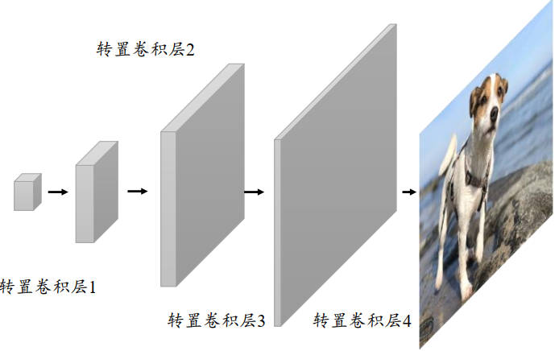

普通卷积需要在列、行上循环移动，效率很低。为加速运算，在数学上将卷积核 $W$ 根据 strides 重排为稀疏矩阵 $W'$，通过一次矩阵相乘实现普通卷积运算。此处以 4×4 的 x，s=1； 3×3 ，padding=0 的卷积核为例：


$$
O'=W'@X_0'\\
X_1'=W'^T@O'
$$
得到 $O'$ ，可生成与 $X$ 同形状大小的张量，但内容不同，如 $W'^T$ [16, 4] @ $O'$ [4, 1] = $X'$ [16, 1]，reshape 后 $X'$ 变为 4×4。

转置卷积具有放大特征图的功能，广泛应用于 GAN 和 语义分割中。

在 TensorFlow 中，可通过 `tf.nn.conv2d_transpose` 实现转置卷积运算，其卷积核定义为 $[k, k, c_{out},c_{in}]$。

- 当设置 padding = 'VALID' 时，输出表达式为：`o= (i-1)s+k`
- 当设置 padding = 'SAME' 时，输出表达式为：`o= is`

转置卷积也可以通过 `layers.Conv2DTranspose` 类创建一个转置卷积层：

```python
layer = layers.Conv2DTranspose(1, kernel_size=3, strides=1, padding='VALID')
```

**分离卷积**

以深度可分离卷 (Depth-wise Separable Convolution) 积为例。分离卷积层包含两步卷积运算，第一步卷积运算是单个卷积核，第二个卷积运算包含多个卷积核。

同样的输入和输出，采用 Separable Convolution 的参数量约为普通卷积的 1/3。如下图：

输入：[m, h, w, c]；卷积层：[k, k, c, m]

- 普通卷积的参数量为：3×3×3×4=108

- 分离卷积的第一部分参数量：3×3×3×1=27

  第二部分的参数量：1×1×3×4=12


分离卷积能实现普通卷积同样的输入输出尺寸变换，但参数量更少。

### 8.7 深度残差网络

15 年，微软亚洲研究院何凯明等发表了基于 Skip Connection 的深度残差网络 ResNet，并提出了 18 层，34 层，101 层，152 层的 ResNet 网络，ResNet-50，ResNet-34 等等。


随着模型的加深，网络的训练变得越来越难，主要是由于梯度弥散和梯度爆炸现象造成的，层数越多，该现象越严重，ResNet 通过在卷积层的输入和输出之间添加 Skip Connection 实现层数回退机制。

为了满足卷积层的输出 $f(x)$ 能够与 $x$ 进行相加运算，要保证二者的 shape 完全一致，否则应进行调整，一般 1×1 卷积居多，主要在于调整输入的通道数。


**DenseNet** ：将前面所有层的特征图信息通过 SkipConnection 与当前层输出进行聚合，即采用在通道轴 c 上进行拼接操作，聚合特征信息。

输出与前面所有层上的特征信息(输出层)在通道轴上进行拼接，得到聚合后的特征向量。


## 9.循环神经网络

### 9.1 循环序列表示方法

**时间序列数据：3D 张量 => (samples，timesteps，features)**

Embeding 层是可训练的，它放置在神经网络之前，**完成单词到向量的转换**。

**使用预训练的词向量**

常用的预训练模型有 Word2Vec 和 GloVe 等。GloVe.6B.50d 词汇量为 40 万，每个单词使用长度为 50 的向量表示。

下载地址：https://nlp.stanford.edu/projects/glove/

常用的激活函数为：**`tanh 函数`**，可不使用偏置 $b$ 来减少参数量。

### 9.2 RNN 概述

让网络能够按顺序提取词向量的语义信息。用内存机制存储所有序列的语义特征，并将序列顺序与内存变量内容相关联。**具体的实现通过状态张量 $h$，**初始化内存状态 $h_0$ 可为 0，经过 $s$ 个向量的输入后得到网络最终的状态张量 $h_s$ **，其中 $h_s$ 可以较好地代表句子地全局语义信息。**
$$
h_t = \sigma(W_{xh}x_t + W_{hh}h_{t-1}+b)
$$
和卷积神经网络几十、上百的深度层来比，循环神经网络很容易出现**梯度弥散和梯度爆炸**，目前常见的 RNN 模型层数一般控制在十层以内。

**RNN 使用方法**

-  `SimpleRNN` 表示基础循环神经网络，基于 `Cell` 层实现，内部完成多个时间戳的前向计算；
- `SimpleRNNCell` 则只完成一个时间戳的前向计算；

### 9.3 爆炸和弥散

原因：在推导 $\displaystyle \frac{\partial L}{\partial W_{hh}}$ 的过程中，$\displaystyle \frac{\partial h_t}{\partial h_i}$ 的梯度包含 $W_{hh}$ 的连乘运算，从而导致循环神经网络难以训练。

$$
h_t = \sigma(W_{xh}x_t + W_{hh}h_{t-1}+b)\\
 \frac{\partial h_{t+1}}{\partial h_t}=W_{hh}^T  \sigma'(W_{xh}x_{k+1}+W_{hh}h_k+b)
$$
当 $W_{hh}$ 的最大特征值 (Largest Eignvalue) 小于 1 时，多次连乘会使得 $\displaystyle \frac{\partial h_t}{\partial h_i}$ 接近于 0 ，大于 1 时，则会使其呈现指数爆炸式增长。

梯度弥散 (Gradient Vanishing) 和梯度爆炸 (Gradient Exploding)。

**梯度裁剪**

解决梯度爆炸，可通过 (Gradient Clipping) 得方式解决：

- 直接通过张量得数值进行限幅，`tf.clip_by_value(gradient, min, max)`
- 限制张量得范数实现梯度裁剪，大于最大值时采用 $\displaystyle W' = \frac{W}{||W||_2}·\max$，`tf.clip_by_norm(a, max)`
- 全局范数裁剪，考虑所有参数梯度的范数，实现等比例缩放，`tf.clip_by_global_norm`

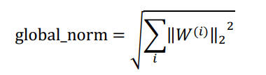

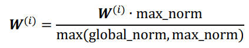

```python
w1 = tf.random.normal([3,3])
w2 = tf.random.normal([3,3])
# 返回两个参数:张量 List 和 global_norm(裁剪前的梯度总范数和), max norm =2
(ww1, ww2), global_norm = tf.clip_by_global_norm([w1, w2], 2)
global_norm2 = tf.math.sqrt(tf.norm(ww1)**2+tf.norm(ww2)**2)
print(global_norm, global_norm2)
```

在模型训练时，梯度裁剪一般在计算出梯度后，梯度更新之前进行。

```python
with tf.GradientTape() as tape:
    logits = model(x)
    loss = criteon(y, logits)
# 计算出梯度值
grads = tape.gradient(loss, model.trainable_variables)
# after_clip, before_clip
grads, _ = tf.clip_by_global_norm(grads, 25)
# 更新参数
optimizer.apply_gradients(zip(grads, model.trainable_variables))
```

**梯度弥散**

梯度训练过程中逐渐趋于 0，梯度从最末层逐渐向首层传播，梯度弥散一般可能出现在网络的开始几层。**深度残差神经网络较好地克服了梯度弥散地现象。**另一方面，可以通过增大学习率和减少网络层深度的方式防止梯度弥散现象。

### 9.4 LSTM


## 10.自编码器

获取样本数据相对容易，但是获取标签较为困难。目前的标注工作多依赖于先验知识 (Prior Knowledge)来完成，容易引入标注人员的主观先验偏差。

### 10.1 原理

监督学习中神经网络的功能：将长度为 $d_{in}$ 的输入特征向量 $x$ 变换到长度为 $d_{out}$ 的输出向量 $0$。**可看作特征降维的过程，即把高输入维度向量 $x$ 变为低维的向量 $o$。**

**特征降维(Dimensionality Reduction)：**在机器学习中有广泛的应用，如文件压缩 (Compression)、数据预处理 (Preprocessing) 等。

**最常见的降维算法为 PCA (Principal components analysis，主成成分分析)：**通过协方差矩阵进行特征分解而得到数据的主成分。本质是一种线性变换，提取特征的能力有限。

**自编码器网络**

标签是自身 $x$：

数据编码 (Encode) 的过程：高维度的 $x$ 变为低维度的隐藏变量 $z$ (Latent Variable)，对应 Encoder 网络。

数据解码 (Decode) 将编码后的输入 $z$ 变为高维度的 $x$，对应 Decoder 网络。

目标：解码器能够完美或近似恢复原来的输入，即 $\bar{x} \approx x $

相较于 PCA 算法，自编码器算法原理非常简单，实现方便且训练稳定。

### 10.2 Fashion MNIST 实践

Fashion MNIST 比 MNIST 图片识别问题稍复杂，设定几乎与 MNIST 完全一样，**用于测试稍复杂的算法性能**

图片大小：28×18；共包含 10 类不同类型的衣服、鞋子、包等灰度图片。

训练集：60000 张；测试集：10000 张；

**自编码器**

- 编码器：3 层全连接层网络，输出节点为 256、128、20，
- 解码器：3 层全连接网络，，输出节点为 128、256、784


详细文件见：[Fashion MNIST 实践](code\chapter10\自编码器.ipynb)

### 10.3 自编码器的变种

一般而言，自编码器的训练较为稳定，但其损失函数是直接度量重建样本和真实样本**底层特征间**的距离，而不是评价重建样本的逼真程度和多样性等**抽象指标**，因此在某些任务上效果一般，如图片重建容易出现边缘模糊。

为了让自编码器学习到数据的真实分布，产生了一系列的自编码器变种网络。

**Denosing Auto-Encoder**

防止神经网络记忆住输入数据的底层特性，该方法给输入数据添加随机的噪声扰动，如给 $x$ 添加采样高斯分布的噪声 $\epsilon$。


